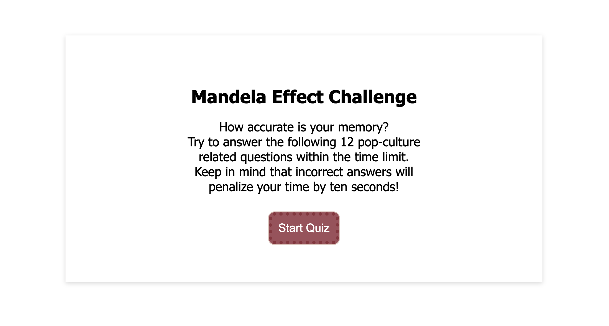
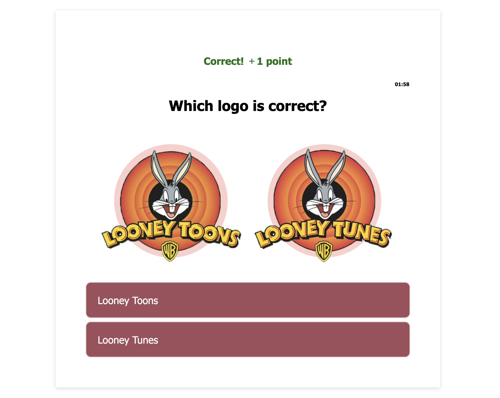
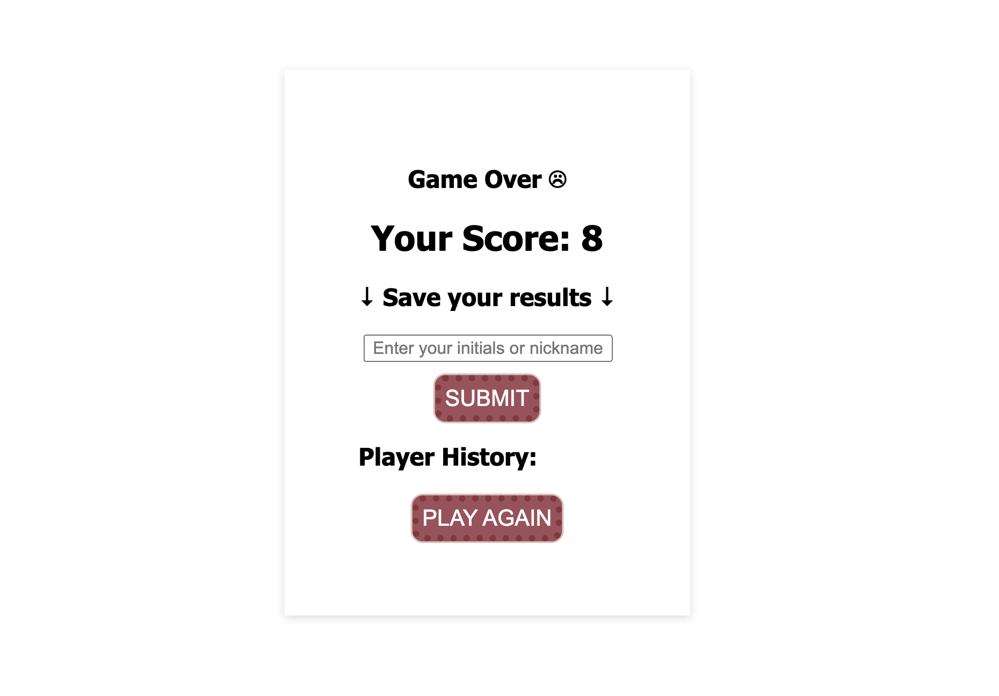

# module04-challenge - Mandela Effect Challenge/Quiz

## Description

How accurate is your memory? The passing of Nelson Mandela in 2013 triggered a world wild realization that things aren't always how we remember them. People upon people began to compare their memories after distinctly remembering Mandela died in prison in the 1980s. The phenomenon is shocking to most, to think something happened one way when it was another. Think you can beat the odds? -- Take the <link><a href="https://samanthashleyrose.github.io/module04-challenge/">Mandela Effect Challenge</a></link> and put your memory to the test!  

The quiz consists of 12 pop-culture related questions that you will need to answer within 2 minutes. That being said, make sure you're certain of your answer. Every time an answer is chosen incorrectly, 10 seconds will be deducted from your current time.

Using HTML, CSS, and JavaScript I was able to create an interactive site to host the game. Making sure to properly write and organize the code allowed for each component to communicate efficiently with each other which made for successful functionality. During the creation of this project, I learned the value of:

- The Document Object
    - The Document Object in JavaScript has a multitude of properties and methods that can access and manipulate your HTML to provide creative functionality. This site uses the .getElementById method and .addEventListener method many times to use the HTML to obtain goals like button pressing and displaying different boxes.
- Local Storage
    - What fun is a game if you can't keep track of the players scores? Local storage allows the site to save the current players information (name, score, date) so they can play the game again and compare their progress. In addition, the player could then compare their scores with any friends who play as well. 

## Table of Contents

- [Installation](#installation)
- [Usage](#usage)
- [Credits](#credits)
- [Features](#features)
- [License](#license)

## Installation

No installation is necessary.

## Usage

After reading the description on the front page, click the "Start Quiz" button to begin. The first question will appear along with a 2 minute timer. Use the images provided to decided which answer is correct. After making a selection you will be briefly notified whether you've selected a correct or incorrect answer before the next question is generated. In addition, if you've selected an incorrect answer the timer will decrease by 10 seconds and display a message notifying the time has been deducted as well. If the timer hits 00:00 before you've answered all 12 questions, the results page will appear with the message "Game Over". If you've answered all 12 questions before the timer hits 00:00, the results page will appear with the message "Game Completed". As you play the game, the system keeps track of all correct answers and displays your total score on the results page. See [Features](#features) to watch how to save your score and play again!

## Credits

#### Knowledge Assitance From:
<li>Lee Warrick <link><a href="https://leewarrick.com/">Personal Portfolio</a></link></li>
<li>Mia Ciasullo <link><a href="https://github.com/miacias/first-portfolio">GitHub Portfolio</a></link></li>
<li>Janvier Mbilizi (Tutor) <link><a href="">insert GitHub Portfolio</a></link></li>
<li>Nicole Choiniere-Kroeker (Classmate) <link><a href="https://github.com/nchoin">GitHub Portfolio</a></link></li>

#### Documentation Used:

<li><link><a href="https://chat.openai.com/">ChatGPT</a></link></li>
<li><link><a href="https://developer.mozilla.org/en-US/docs/Web/CSS/z-index">MDN Web Docs z-index</a></link></li>
<li><link><a href="https://www.w3schools.com/js/js_json_parse.asp">W3schools JSON.parse()</a></link></li>
<li><link><a href="https://www.w3schools.com/jsref/met_win_settimeout.asp">W3schools Window setTimeout()</a></link></li>
<li><link><a href="https://stackoverflow.com/questions/20618355/how-to-write-a-countdown-timer-in-javascript"> Countdown Timer - Stackoverflow</a></link></li>
<li><link><a href="https://stackoverflow.com/questions/40723239/i-need-some-explanation-for-some-of-this-code"> Timer Explanation - Stackoverflow</a></link></li>
<li><link><a href="https://www.w3schools.com/jsref/jsref_tolocalestring.asp">W3schools Javascript Date toLocaleString</a></link></li>
<li><link><a href="https://www.w3schools.com/js/js_htmldom_document.asp">W3schools Javascript HTML DOM Document</a></link></li>
<li><link><a href="https://simplestepscode.com/javascript-quiz-tutorial/">How to make a simple JavaScript quiz - Simple Steps Code</a></link></li>
<li><link><a href="https://www.youtube.com/watch?v=WUBhpSRS_fk">Create a Quiz App with Timer using HTML CSS & JavaScript | CodingNepal - YouTube</a></link></li>
<li><link><a href="https://www.goodhousekeeping.com/life/entertainment/g28438966/mandela-effect-examples/?utm_source=google&utm_medium=cpc&utm_campaign=arb_ga_ghk_d_bm_prog_org_us_g28438966&gclid=CjwKCAjwvfmoBhAwEiwAG2tqzEm3ILlTVFh9cMIXKPhYzc6PSgRWb6MrEcwgHy8IygZhuaA6ZZ4rTxoCr_cQAvD_BwE">53 Mandela Effect Examples That Will Make Question Everything - Good Housekeeping</a></link></li>

## Features

Say you've finished the game with a score you want to remember, the results page has a built-in Player History Feature to complete that task. Go ahead and enter your initials/nickname into the field on the page and click submit. You'll immediately see your entered information display under Player History along with the date and time you played. Great! Now that your results are saved, want to give it another go? Click Play Again to reload the page! You can save your score an unlimited amount of time to track your progress and compare against other players as well. 

https://github.com/samanthashleyrose/module04-challenge/assets/142939966/50457ad6-4df8-4087-be39-70ae3c607557

The Player History Feature uses Local Storage to display the results onto the screen. The results are also listed in Chrome Dev Tools under Applications for additional reference.

## License

Please refer to the MIT LICENSE in the repo.
